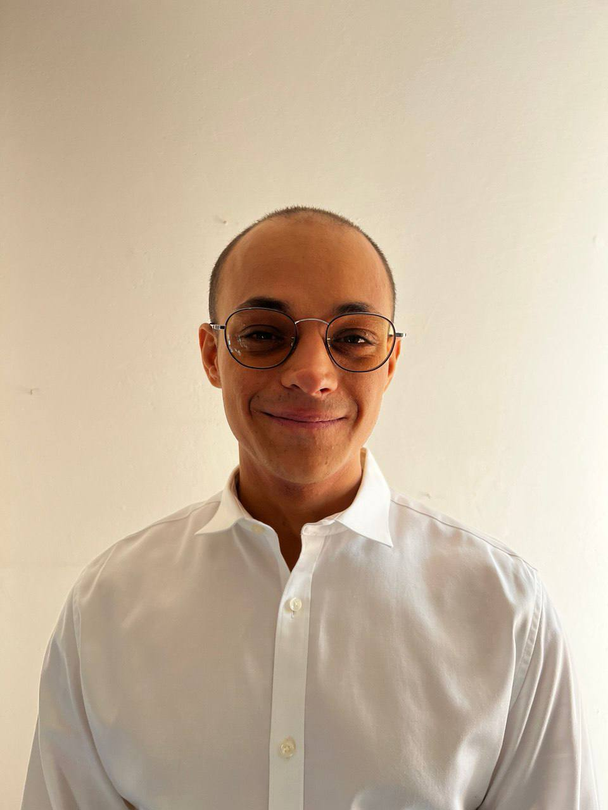
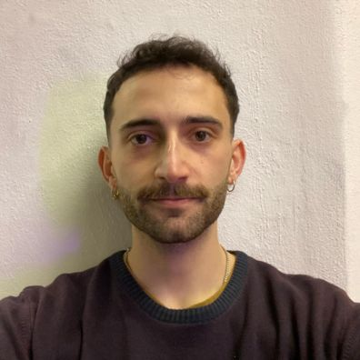

# ANTHROPOCENE
### An immersive audiovisual installation simulating humanity's transformative impact and the progressive erosion of the natural world.

[](https://github.com/cumulo-autumn/StreamDiffusion)
[](https://supercollider.github.io)
[](https://python.org)
[](LICENSE)


## About Us
### Meet Our Team

<table style="width:100%; table-layout:fixed; border-collapse: collapse;">
  <tr>
    <td style="width:25%; vertical-align:top;">
      <div style="text-align:center;">
        
        <h4>Matteo Di Giovanni</h4>
        <p>MSc in Music & Acoustic Engineering @POLIMI<br>BSc in ? Engineering @POLIMI</p>
        <p>
          <a href="">Mail</a> |
          <a href="https://github.com/matteodigii" target="_blank">GitHub</a> |
          <a href="" target="_blank">LinkedIn</a>
        </p>
      </div>
    </td>
    <td style="width:25%; vertical-align:top;">
      <div style="text-align:center;">
        
        <h4>Alessandro Mancuso</h4>
        <p>MSc in Music & Acoustic Engineering @POLIMI<br>BSc in Computer Engineering @UniBo</p>
        <p>
          <a href="">Mail</a> |
          <a href="https://github.com/AleMancusoPOLI" target="_blank">GitHub</a> |
          <a href="" target="_blank">LinkedIn</a>
        </p>
      </div>
    </td>
    <td style="width:25%; vertical-align:top;">
      <div style="text-align:center;">
        
        <h4>Filippo Paris</h4>
        <p>MSc in Music & Acoustic Engineering @POLIMI<br>BSc in Computer Engineering @UniBo</p>
        <p>
          <a href="mailto:filippoparis.pro@gmail.com">Mail</a> |
          <a href="https://github.com/fparismusic" target="_blank">GitHub</a> |
          <a href="http://www.linkedin.com/in/filippoparis" target="_blank">LinkedIn</a>
        </p>
      </div>
    </td>
    <td style="width:25%; vertical-align:top;">
      <div style="text-align:center;">
        
        <h4>Emanuele Turbanti</h4>
        <p>MSc in Music & Acoustic Engineering @POLIMI<br>BSc in ? Engineering @UniBo</p>
        <p>
          <a href="">Mail</a> |
          <a href="https://github.com/tutututurbo" target="_blank">GitHub</a> |
          <a href="" target="_blank">LinkedIn</a>
        </p>
      </div>
    </td>
  </tr>
</table>

---

## Table of Contents
01. 📖 [Overview](#overview)  
02. ✨ [The Experience](#the-experience)  
03. 🚀 [Installation & Setup](#installation--setup)
04. 📁 [Project Structure](#-project-structure)  
05. 🛠️ [Technology Stack](#technology-stack)
06. 🌍 [Credits & Attributions](#credits--attributions)
07. 📸 [Visual Preview](#visual-preview)  
08. 📄 [License & Usage Terms](#license--usage-terms)

---

## 📖 Overview
**Anthropocene** serves as a bridge between scientific observation and cultural philosophy, manifesting as an interactive audiovisual environment that vividly reconstructs how human presence reshapes the Earth's biosphere. Envisioned as an artistic installation with a generative environment driven by real-time sensors and AI, the project forces a direct confrontation with the reality of how human presence alters and reshapes the natural environment.  

## ✨ The Experience
The user experience begins in a state of pure nature, immersing participants in pristine visuals and sounds, but as camera-based sensors track their movement, the system responds with a progressive metamorphosis: the landscape decays into urban forms and industrial noise, directly reflecting the audience's reshaping influence. This dynamic evolution is designed to foster emotional resonance and intuitive responsibility, inviting viewers to move beyond judgment and engage in deep reflection on their relationship with our world. 

### Phase I: Genesis (Pure Nature)
* **Visuals:** Participants enter an enclosed space immersed in a pristine natural landscape.
* **Audio:** Natural soundscapes—birdsong, wind, flowing water etc.
* **State:** Untouched wilderness.

### Phase II: Colonisation (Progressive Interaction)
* **Trigger:** Sensors detect human presence via computer vision (camera detection).
* **Visuals:** The equilibrium is broken. Vegetation stiffens, and organic branches mutate into geometric shapes and artificial lights.
* **Audio:** Metallic rhythms and distant engines superimpose over the wind.

### Phase III: Saturation (Urban Dominance)
* **Visuals:** The digital city takes complete control. Glitches, frantic traffic, and visual pollution saturate the screens.
* **Audio:** The soundscape collapses into auditory chaos, reflecting acoustic stress.

### Cycle: Collapse or Rebirth
When the room empties, the structures disintegrate littel by little, allowing the forest to slowly regenerate to its initial state.


## 🚀 Installation & Setup

### Hardware Requirements
* **Projector:** For immersive visual output.
* **Camera:** For presence detection (webcam or USB camera).
* **Speakers:** For spatial audio experience.
* **Internet Connection:** Required for remote Stream Diffusion inference.

### Running the Project
1.  **Audio:** Boot the **SuperCollider** server and load the `main.scd` file to start the audio engine.
2.  **Sensing:** Run the **Python** controller to start the computer vision system:
    ```bash
    pip install ultralytics python-osc
    python detection_controller.py
    ```
3.  **Visuals:** Open `Anthropocene.toe` in **TouchDesigner**. Ensure the OSC in/out ports match the Python configuration.

## 📁 Project Structure

## 🛠️ Technology Stack

The system relies on a distributed architecture to handle real-time generative media.

### Visual System
* **TouchDesigner:** Handles dynamic environmental rendering, fluid state transitions, and responsive visual morphing.
* **Stream Diffusion (Remote):** Utilized for high-fidelity generative landscapes. Due to high computational costs, models are run on remote servers.
* **DayDream:** A lightweight visual framework used for post-processing effects and ambient textures that bridge the gap between generative AI and real-time rendering.

### Audio Engine
* **SuperCollider:** Generates adaptive soundscapes using procedural sound design and granular synthesis.
* **Reaper:** Acts as the primary Digital Audio Workstation for music composition.

### Interaction & Sensing
* **YOLO (Ultralytics):** Camera-based presence detection and multi-participant tracking.
* **Python:** A communication pipeline that normalizes tracking data and controls system parameters in real-time.
* **OSC:** The low-latency network protocol used to synchronize data between Python, SuperCollider, and TouchDesigner.
* **DMX:** Controls the physical lighting environment.

### Key Packages
```yaml
dependencies:
  # Phyton
  python: 3.12
```

## 🌍 Credits & Attributions

## 📸 Visual Preview

---

## 📄 License & Usage Terms
**ANTHROPOCENE © 2026 All Rights Reserved.** 

This project is an academic work developed for the **Creative Programming and Computing Course A.A. 2025/26 - Politecnico di Milano**. No part of this project may be reproduced or used for commercial purposes without explicit permission from the authors.
