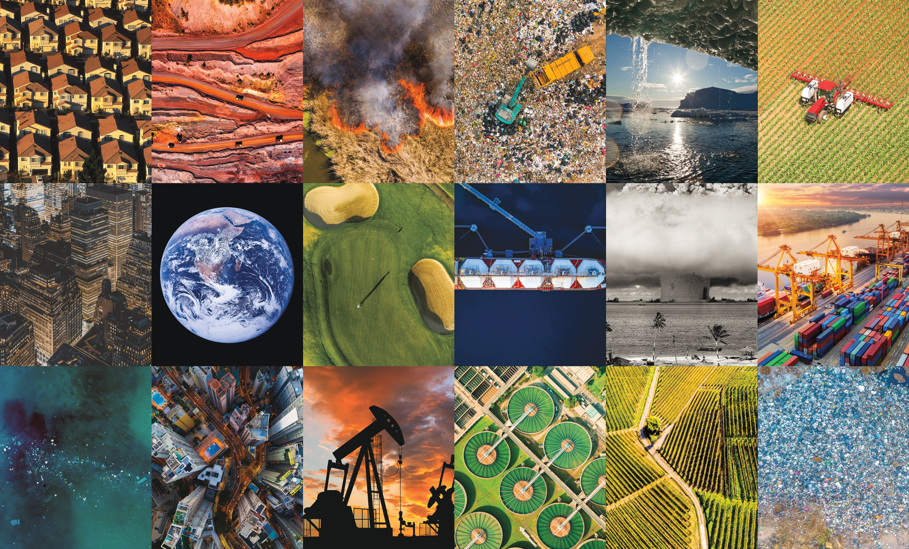
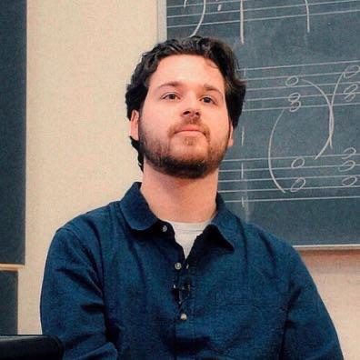
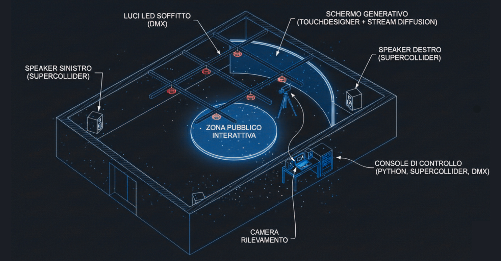
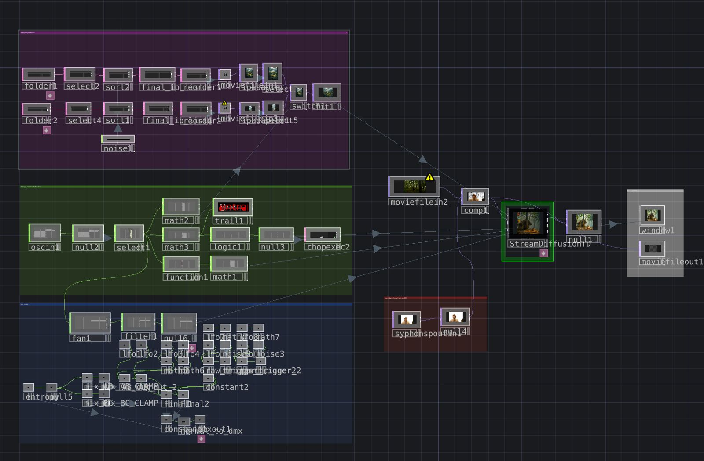
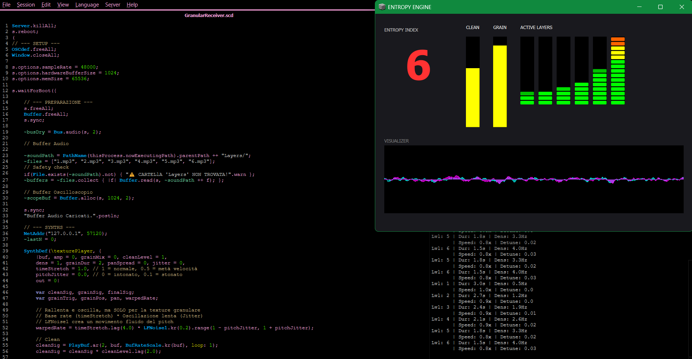

# ANTHROPOCENE
### An immersive audiovisual installation simulating humanity's transformative impact and the progressive erosion of the natural world.

[](https://github.com/cumulo-autumn/StreamDiffusion)
[](https://supercollider.github.io)
[](https://python.org)
[](LICENSE)



## About Us
### Meet Our Team

<table style="width:100%; table-layout:fixed; border-collapse: collapse;">
  <tr>
    <td style="width:25%; vertical-align:top;">
      <div style="text-align:center;">
        
        <h4>Matteo Di Giovanni</h4>
        <p>MSc in Music & Acoustic Engineering @POLIMI<br>BSc in Telecommunication Engineering @POLIMI</p>
        <p>
          <a href="mailto:matteo.digiovanni@mail.polimi.it">Mail</a> |
          <a href="https://github.com/matteodigii" target="_blank">GitHub</a> 
          <!--a href="" target="_blank">LinkedIn</a>-->
        </p>
      </div>
    </td>
    <td style="width:25%; vertical-align:top;">
      <div style="text-align:center;">
        
        <h4>Alessandro Mancuso</h4>
        <p>MSc in Music & Acoustic Engineering @POLIMI<br>BSc in Computer Engineering @UniBo</p>
        <p>
          <a href="mailto:alessandro2.mancuso@mail.polimi.it">Mail</a> |
          <a href="https://github.com/AleMancusoPOLI" target="_blank">GitHub</a> 
          <!--a href="" target="_blank">LinkedIn</a>-->
        </p>
      </div>
    </td>
    <td style="width:25%; vertical-align:top;">
      <div style="text-align:center;">
        
        <h4>Filippo Paris</h4>
        <p>MSc in Music & Acoustic Engineering @POLIMI<br>BSc in Computer Engineering @UniBo</p>
        <p>
          <a href="mailto:filippoparis.pro@gmail.com">Mail</a> |
          <a href="https://github.com/fparismusic" target="_blank">GitHub</a> |
          <a href="http://www.linkedin.com/in/filippoparis" target="_blank">LinkedIn</a>
        </p>
      </div>
    </td>
    <td style="width:25%; vertical-align:top;">
      <div style="text-align:center;">
        
        <h4>Emanuele Turbanti</h4>
        <p>MSc in Music & Acoustic Engineering @POLIMI<br>BSc in Electrical Engineering @UniBo</p>
        <p>
          <a href="mailto:emanuele.turbanti@mail.polimi.it">Mail</a> |
          <a href="https://github.com/tutututurbo" target="_blank">GitHub</a> 
          <!--a href="" target="_blank">LinkedIn</a>-->
        </p>
      </div>
    </td>
  </tr>
</table>

---

## Table of Contents
01. 📖 [Overview](#-overview)
02. ✨ [The Experience](#-the-experience)
03. 📁 [Project Structure](#-project-structure)  
04. 🚀 [Installation & Setup](#-installation--setup)
05. 🛠️ [Technology Stack](#-technology-stack)
06. 📽️ [Visual System](#-visual-system)
07. 🔊 [Audio System](#-audio-system)
08. 💡 [Lighting System](#-lighting-system)
09. 🌍 [Credits & Attributions](#-credits--attributions)
10. 📸 [Visual Preview](#-visual-preview)  
11. 📄 [License & Usage Terms](#-license--usage-terms)

---

## 📖 Overview
**Anthropocene** serves as a bridge between scientific observation and cultural philosophy, manifesting as an interactive audiovisual environment that vividly reconstructs how human presence reshapes the Earth's biosphere. Envisioned as an artistic installation with a generative environment driven by real-time sensors and AI, the project forces a direct confrontation with the reality of how human presence alters and reshapes the natural environment.  

## ✨ The Experience
The user experience begins in a state of pure nature, immersing participants in pristine visuals and sounds, but as camera-based sensors track their movement, the system responds with a progressive metamorphosis: the landscape decays into urban forms and industrial noise, directly reflecting the audience's reshaping influence. This dynamic evolution is designed to foster emotional resonance and intuitive responsibility, inviting viewers to move beyond judgment and engage in deep reflection on their relationship with our world. 

### Phase I: Genesis (Pure Nature)
* **Visuals:** Participants enter an enclosed space immersed in a pristine natural landscape.
* **Audio:** Natural soundscapes—birdsong, wind, flowing water etc.
* **State:** Untouched wilderness.

### Phase II: Colonisation (Progressive Interaction)
* **Trigger:** Sensors detect human presence via computer vision (camera detection).
* **Visuals:** The equilibrium is broken. Vegetation stiffens, and organic branches mutate into geometric shapes and artificial lights.
* **Audio:** Metallic rhythms and distant engines superimpose over the wind.

### Phase III: Saturation (Urban Dominance)
* **Visuals:** The digital city takes complete control. Glitches, frantic traffic, and visual pollution saturate the screens.
* **Audio:** The soundscape collapses into auditory chaos, reflecting acoustic stress.

### Cycle: Rebirth
When the room empties, the structures disintegrate little by little, allowing the forest to slowly regenerate to its initial state.

## 📁 Project Structure

<div align="center">
  
  <br>
  <em>Fully realized architectural vision of Anthropocene.</em> <br><br>
</div>

While the project can be scaled down for smaller demonstrations, this layout represents the optimal deployment designed for a dedicated exhibition space with sufficient resources.

* **Central Console:** The "brain" of the operation (Laptop/Workstation), managing the OSC communication pipeline between vision, audio, and sensing logic.

* **Immersive Visual:** A large-scale generative screen (or projection) dominates the scene, driven by TouchDesigner and Stream Diffusion.

* **Spatial Audio Field:** Two active speakers (Stereo) are positioned flanking the screen. Controlled by SuperCollider, they create a stereo field that physically envelops the audience.

* **Interactive Zone:** A centralized area where the audience is tracked. A standalone camera, positioned towards the crowd, feeds real-time data to the Python/YOLO controller to trigger state changes based on crowd density.

* **Atmospheric Lighting:** A grid of DMX-controlled LED spots on the ceiling (or on the ground) reacts to the system's "entropy level".

## 🚀 Installation & Setup

### Hardware Requirements
* **Projector:** For immersive visual output.
* **Camera:** For presence detection (webcam or USB camera).
* **Speakers:** For spatial audio experience.
* **Computing Power:**
  * **Internet connection:** Required for remote Stream Diffusion inference.
  * **OR High-end GPU:** (e.g., NVIDIA RTX 3080 or higher) to run the model locally without an internet connection.

### Running the Project
1.  **Assets & Media:**
    * Download the image dataset and the audio samples.
    * Place the `Layers` folder in the same directory as the SuperCollider script.
    * Ensure the `Images` (Dataset) folder is placed in the project root for TouchDesigner access.
2.  **Audio:** Boot the **SuperCollider** server and load the `GranularReceiver.scd` file to start the audio engine.
3.  **Sensing:** Run the **Python** controller to start the computer vision system:
    ```bash
    pip install ultralytics python-osc
    python detection_controller.py
    ```
4.  **Visuals:** Open `Anthropocene.toe` in **TouchDesigner**. Ensure the OSC in/out ports match the Python configuration.

## 🛠️ Technology Stack

The system relies on a distributed architecture to handle real-time generative media.

### Visual Engine
* **TouchDesigner:** Handles dynamic environmental rendering, fluid state transitions, and responsive visual morphing.
* **Stream Diffusion (Remote):** Utilized for high-fidelity generative landscapes. Due to high computational costs, models are run on remote servers.
* **DayDream:** A lightweight visual framework used for post-processing effects and ambient textures that bridge the gap between generative AI and real-time rendering.

### Audio Engine
* **SuperCollider:** Generates adaptive soundscapes using procedural sound design and granular synthesis.
* **Reaper:** Acts as the primary Digital Audio Workstation for music composition.

### Interaction & Sensing
* **YOLO (Ultralytics):** Camera-based presence detection and multi-participant tracking.
* **Python:** A communication pipeline that normalizes tracking data and controls system parameters in real-time.
* **OSC:** The low-latency network protocol used to synchronize data between Python, SuperCollider, and TouchDesigner.
* **DMX:** Controls the physical lighting environment.

### Key Packages
```yaml
dependencies:
  # Python
  python: 3.x
  pythonosc
  numpy
  time
  cv2

  # YOLO ultralytics models
  yolov8n-seg.pt

  # TouchDesigner
  DayDream API
```

## 📽️ Visual System

The visual core of **Anthropocene** is a real-time generative pipeline built in **TouchDesigner**. It functions as a centralized hub that interprets sensor data and translates it into a visual metamorphosis. The system does not merely play back video; it integrates new frames in real-time based on the audience's live behavior.

<div align="center">
  
  <br>
  <em>The TouchDesigner network orchestrating the generative pipeline.</em>
</div>

The network architecture is divided into three logical blocks:

The system operates as a continuous, feedback-driven loop:

* **Logic & State Control:** The network listens for the `/entropy_level` via OSC to determine the installation's current phase (Genesis, Colonisation, or Saturation). These logic gates drive the parameters of the generative model, ensuring the visuals remain synchronized with the audio and lighting atmosphere.

* **Live Input & Motion:** To ground the AI generation in physical reality, the system ingests a live camera feed of the audience via **Syphon**. This real-time visual input is blended with pre-rendered video assets to provide **StreamDiffusion** with a sense of movement, spatial dimension, and organic fluctuation.

* **Generative Morphing:** The combined video signal is processed by the **StreamDiffusionTD** component, which acts as the neural rendering engine. Through dynamic **Prompt Interpolation**, the AI re-imagines the scene in real-time—shifting from keywords like *"pristine forest, 4k, organic"* to *"cyberpunk city, destruction, glitch"*—effectively allowing the audience's physical movements to visually corrupt the digital landscape.

## 🔊 Audio System

The auditory experience of **Anthropocene** is driven by a custom-built generative engine developed in **SuperCollider**. Unlike traditional loop-based playback, the system employs **Real-Time Granular Synthesis** to sonically represent the erosion of the natural world.

The audio engine listens for OSC messages (`/entropy_level`) from the central control unit and dynamically manipulates the soundscape through a custom synth architecture (`\texturePlayer`).

<div align="center">
  
  <br>
  <em>The custom "Entropy Engine" GUI built in SuperCollider for real-time granular control.</em>
</div>

### The Entropy Engine
The system manages 6 distinct audio layers, morphing them based on the crowd's activity level. As the "Entropy Level" rises, the engine applies the following transformations:

* **Granular Erosion:** The signal is split between a "clean" path and a "granular" path. As human presence increases, the system fragments the audio into microscopic grains (`GrainBuf`), creating a cloudy, textured, and disintegrated sound.
* **Time Dilation:** High entropy levels trigger a time-stretching algorithm that slows down the playback speed (down to 50%) without altering the window size, creating a heavy, dragging atmosphere.
* **Harmonic Dissonance:** A `pitchJitter` parameter is introduced at peak levels, randomly detuning the grains to generate acoustic discomfort and instability.
* **Spatial Wash:** The signal is fed into a stereo reverb (`FreeVerb2`) whose room size and wet mix expand proportionally with the chaos, drowning the clarity of nature in a wash of industrial noise.

### Technical Flow
1.  **Input:** OSC Data (`/entropy_level`) → **Logic:** Layer blending & Parameter Mapping → **Synthesis:** Granular Texture → **FX:** Reverb & Limiting → **Output:** Stereo Field.

## 💡 Lighting System

The TouchDesigner project includes a system for automatic lighting management. The installation is thought for 2 fixtures, but can be easily 

## 🌍 Credits & Attributions

This project was conceived and developed as part of the **Creative Programming and Computing** course (A.Y. 2025/2026) at **Politecnico di Milano**.

**Core Frameworks & Libraries**
* **Generative Visuals:** [Stream Diffusion](https://github.com/cumulo-autumn/StreamDiffusion) pipeline & [TouchDesigner](https://derivative.ca/).
* **Audio Engine:** [SuperCollider](https://supercollider.github.io/) (Real-time synthesis) & [Reaper](https://www.reaper.fm/) (Composition).
* **Sensing & Logic:** [Ultralytics YOLO](https://github.com/ultralytics/ultralytics) for computer vision & `python-osc` for networking.

**Acknowledgements**
* Special thanks to the open-source community for the **DayDream** visual framework.
* Models hosted and accelerated via **HuggingFace**.
  
## 📸 Visual Preview

---

## 📄 License & Usage Terms
**ANTHROPOCENE © 2026 All Rights Reserved.** 

No part of this project may be reproduced or used for commercial purposes without explicit permission from the authors.
